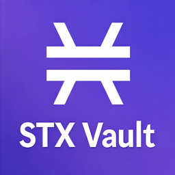
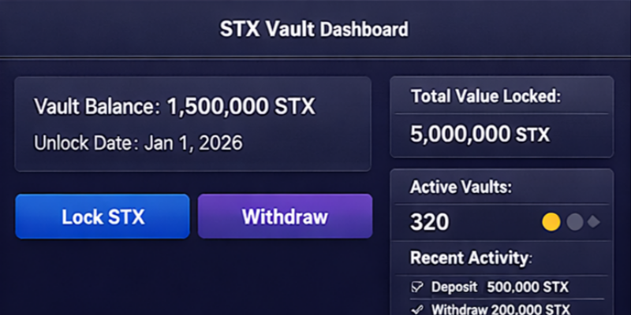

#  STX Vault SDK

[](https://www.npmjs.com/package/stx-vault-sdk)
[](https://github.com/investorphem/stx-vault-sdk/actions)
[](LICENSE)
[](https://www.npmjs.com/package/stx-vault-sdk)
[](https://www.stacks.co/)
[](https://developer.mozilla.org/en-US/docs/Web/JavaScript)
[](https://www.typescriptlang.org/)

---

## Overview

**STX Vault SDK** is a **production-ready JavaScript/TypeScript SDK** for building **STX vaults and time-lock applications** on the **[Stacks](https://www.stacks.co/)** blockchain.

It allows developers to:

* Lock STX in smart contract vaults
* Withdraw funds after the unlock period
* Create new vaults (multi-pool support)
* Track real-time vault events
* Get vault analytics & TVL
* Connect wallets like **Xverse** and **Leather**
* Use React hooks for front-end apps
* Interact via CLI commands



---

## Installation

```bash
npm install stx-vault-sdk
```

---

## Quick Start

### Connect Wallet

```javascript
import { connectWallet } from "stx-vault-sdk"
await connectWallet()
```

### Lock STX

```javascript
import { lockSTX } from "stx-vault-sdk"
await lockSTX(
  100000000,
  900000,
  PRIVATE_KEY,
  CONTRACT_ADDRESS,
  "stx-vault"
)
```

### Withdraw STX

```javascript
import { withdrawSTX } from "stx-vault-sdk"
await withdrawSTX(
  PRIVATE_KEY,
  CONTRACT_ADDRESS,
  "stx-vault"
)
```

### Create Vault

```javascript
import { createVault } from "stx-vault-sdk"
await createVault(
  900000,
  PRIVATE_KEY,
  CONTRACT_ADDRESS,
  "stx-vault"
)
```

### Get Vault Balance

```javascript
import { getVaultBalance } from "stx-vault-sdk"
const balance = await getVaultBalance(
  USER_ADDRESS,
  CONTRACT_ADDRESS,
  "stx-vault"
)
console.log("Vault Balance:", balance)
```

### React Hook Example

```javascript
import { useVault } from "stx-vault-sdk"
const { balance, refresh } = useVault(USER_ADDRESS, CONTRACT_ADDRESS, "stx-vault")
```

### CLI Usage

```bash
npx stx-vault connect
npx stx-vault lock -a 1000000 -b 900000 -k YOUR_KEY -c SPXXXX -n stx-vault
npx stx-vault withdraw -k YOUR_KEY -c SPXXXX -n stx-vault
npx stx-vault create -b 900000 -k YOUR_KEY -c SPXXXX -n stx-vault
```

### Analytics & TVL

```javascript
import { getVaultStats, getVaultTVL } from "stx-vault-sdk"
const stats = await getVaultStats("https://api.yourvault.com")
const tvl = await getVaultTVL("https://api.yourvault.com")
```

### Real-time Vault Events

```javascript
import { watchVaultEvents } from "stx-vault-sdk"
const events = await watchVaultEvents(
  "https://api.mainnet.hiro.so",
  "SPXXXX.stx-vault"
)
console.log(events)
```

### Supported Wallets

* **Xverse Wallet** 
* **Leather Wallet** 

### Badges & Ecosystem

* Works on **Stacks Mainnet**
* Supports **mobile-first wallets**
* TypeScript-ready for front-end & back-end apps
* Fully **DeFi protocol-ready SDK**

### License

[MIT](LICENSE)
